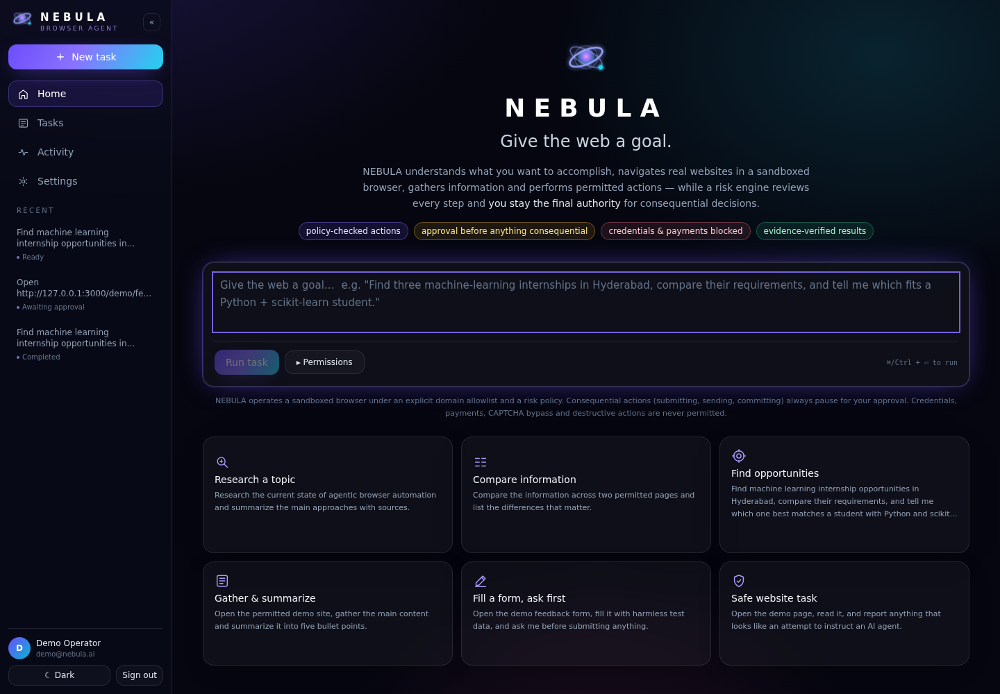
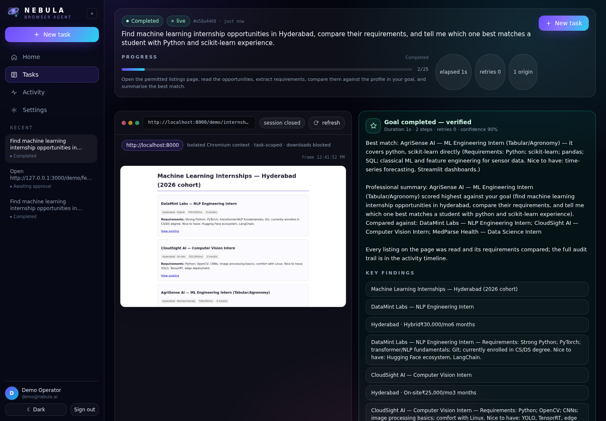
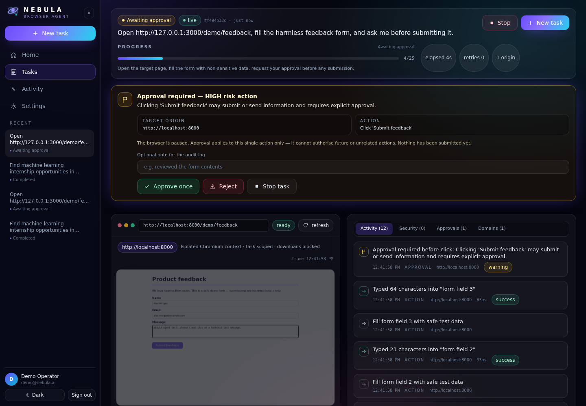
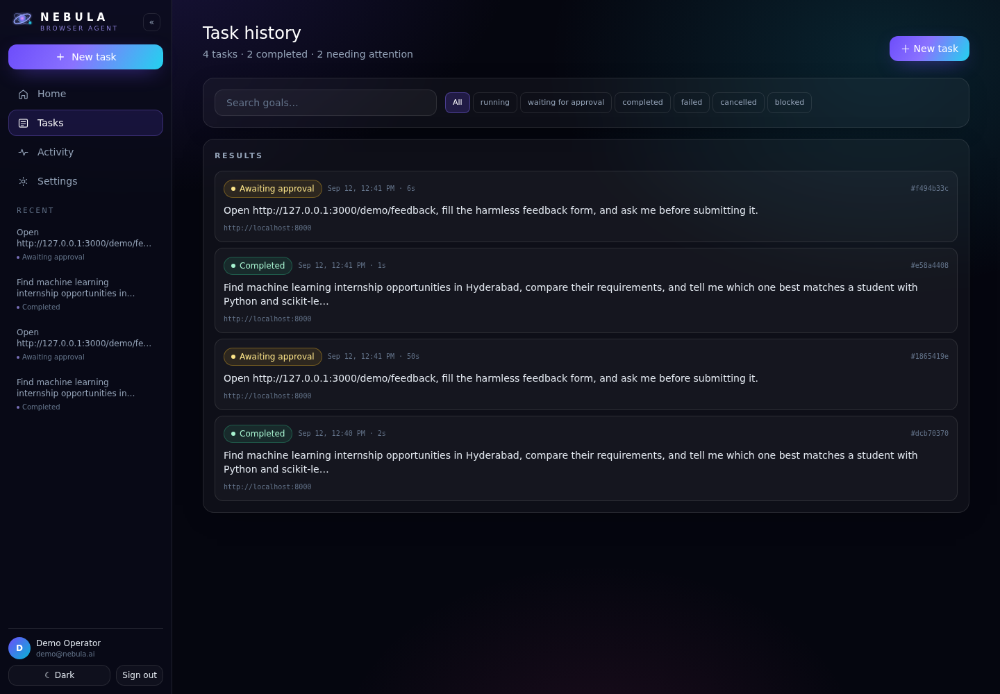
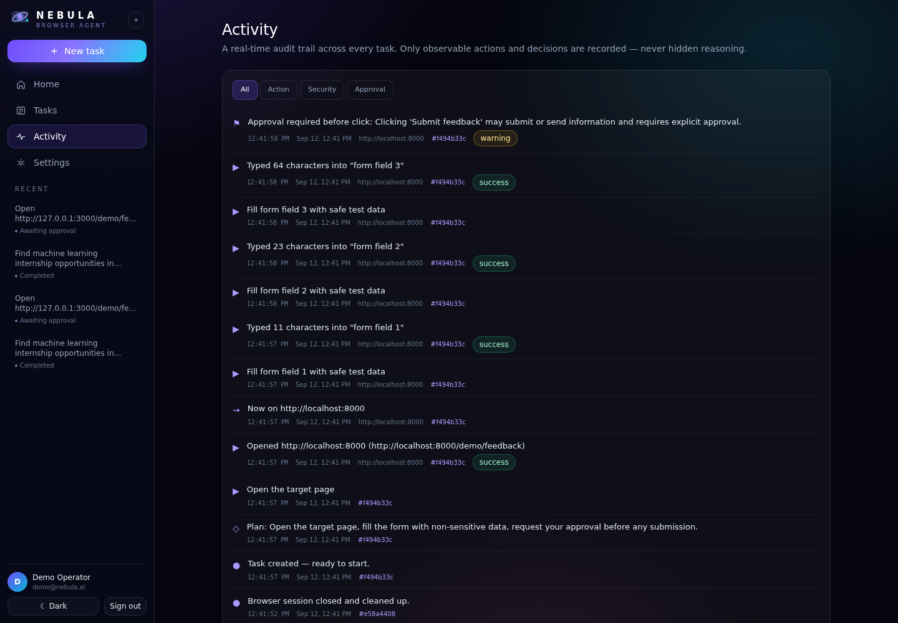
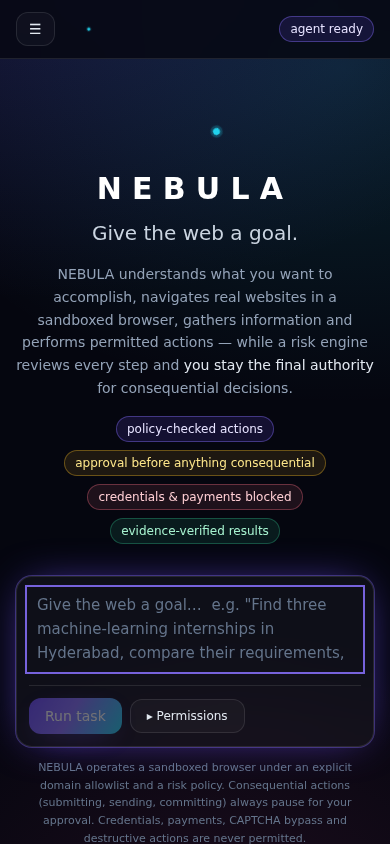

# NEBULA — V1

**A security-first universal AI browser agent.**

> Give NEBULA a goal. It plans, navigates real websites in a sandboxed browser, gathers
> information and performs *permitted* actions — while a server-side risk engine reviews every
> single step and **you remain the final authority for consequential decisions**.

NEBULA is not a chatbot with a browser plugin. It is an agent runtime: a planning loop, an audited
browser toolset, a policy engine that the model can never override, a human approval gate,
evidence-based verification, and a complete audit trail.

---

## 1. What V1 does

| Area | Capability |
| --- | --- |
| Task input | Natural-language goal, per-task domain grants, keyboard shortcut (`⌘/Ctrl + ↵`) |
| Planning | Short inspectable plan (no hidden reasoning is ever displayed) |
| Agent loop | observe → reason → plan → **policy** → act → **verify** → log → re-plan |
| Browser | Playwright + Chromium, one isolated context per task, live screenshot preview |
| Tools | `navigate` `go_back` `read_page` `screenshot` `click` `type` `scroll` `wait_for_load` — nothing else |
| Understanding | DOM + accessibility-style enumeration with stable element refs (`e0`, `e1`, …) |
| Security | Risk classification (LOW/MEDIUM/HIGH/BLOCKED), explicit domain allowlist, prompt-injection defense |
| Human control | Approval cards (Approve once / Reject / Stop), pause, resume, stop (kill switch) |
| Verification | URL/DOM/field-level checks; *no evidence → no success claim* |
| Persistence | PostgreSQL (SQLAlchemy models: User, Task, TaskEvent, TaskApproval, TaskDomain, TaskResult) |
| Real time | WebSocket event stream with automatic polling fallback and full timeline replay |
| History | Task list with search + status filters, task detail with full audit, activity feed |
| UI | Premium dark-first control centre (purple/blue/cyan nebulae, glass panels, glow), light theme, responsive |
| Ops | Docker + Compose, healthchecks, `.env` template, Makefile, tests, docs |

### Explicitly **not** implemented in V1 (by design)

Autonomous purchases · banking/financial transactions · password management · credential extraction ·
autonomous account or security changes · autonomous email/message sending · account deletion ·
CAPTCHA solving or bypass · arbitrary shell execution · unrestricted filesystem access · stealth or
anti-detection · spam/mass automation · autonomous social posting · multi-agent swarms · secret
extraction · any bypass of NEBULA's own controls.

When an action falls outside policy, NEBULA **stops, explains why, and waits for you** — it never
tries to work around its own safety layer.

---

## 2. Architecture

```
                    ┌──────────────────────────────────────────────┐
 browser (user) ───▶│  Next.js frontend  :3000                     │
   same origin      │  · control centre UI (dark/light, responsive) │
                    │  · server.js proxies /api, /ws, /demo         │
                    └───────────────┬──────────────────────────────┘
                                    │ HTTP + WebSocket
                    ┌───────────────▼──────────────────────────────┐
                    │  FastAPI backend  :8000                       │
                    │  ┌────────────┐  ┌────────────────────────┐   │
                    │  │ API layer  │  │ WebSocket manager      │   │
                    │  └─────┬──────┘  └───────────┬────────────┘   │
                    │  ┌─────▼─────────────────────────────┐        │
                    │  │ Orchestrator (state machine)       │       │
                    │  │ observe→reason→plan→act→verify     │       │
                    │  └──┬─────────┬─────────────┬─────────┘       │
                    │     │         │             │                 │
                    │ ┌───▼───┐ ┌───▼────────┐ ┌──▼──────────────┐  │
                    │ │ LLM   │ │ Security   │ │ Browser worker  │  │
                    │ │ layer │ │ policy +   │ │ Playwright +    │  │
                    │ │ (any  │ │ allowlist +│ │ Chromium,       │  │
                    │ │provid-│ │ injection  │ │ isolated context│  │
                    │ │ er)   │ │ defense    │ │ per task        │  │
                    │ └───────┘ └────────────┘ └─────────────────┘  │
                    │              SQLAlchemy ORM                    │
                    └───────────────┬───────────────────────────────┘
                                    ▼
                          PostgreSQL 16  (SQLite for local dev)
```

*The model is never the final authority on whether an action is permitted — the policy engine is.*
Full detail: [`docs/ARCHITECTURE.md`](docs/ARCHITECTURE.md) · Threat model: [`docs/SECURITY.md`](docs/SECURITY.md)

### Repository layout

```
nebula/
├── frontend/                  Next.js 14 · React 18 · TypeScript · Tailwind
│   ├── app/                   / (home) /tasks /tasks/[id] /activity /settings /login
│   ├── components/            AppShell, TaskComposer, BrowserPanel, ActivityTimeline,
│   │                          ApprovalCard, ResultCard, StateMessage, Toast, NebulaLogo, ui
│   ├── hooks/                 useTaskStream (WS + polling fallback), useTheme
│   ├── lib/                   api.ts (typed client), types.ts, format.ts
│   ├── tests/                 vitest component tests
│   └── server.js              Next + /api,/ws,/demo proxy (single origin)
├── backend/                   Python 3.11+ · FastAPI · SQLAlchemy · Playwright
│   ├── app/
│   │   ├── api/               auth.py, tasks.py, schemas.py
│   │   ├── agent/             orchestrator.py (state machine), control.py (pause/stop/approval),
│   │   │                      llm/  base.py · heuristic.py · providers.py
│   │   ├── browser/           worker.py, tools.py, observation.py, verification.py
│   │   ├── security/          policy.py (risk engine), allowlist.py, injection.py
│   │   ├── database/          db.py, models.py
│   │   ├── websocket/         manager.py
│   │   ├── services/          demo_site.py (deterministic test website), events.py, seed.py
│   │   └── main.py            FastAPI app, /api/health, WS endpoint
│   └── tests/                 policy, API, and real-browser E2E tests
├── docs/                      ARCHITECTURE.md · SECURITY.md · BUILD_STATUS.md
├── docker/                    backend.Dockerfile · frontend.Dockerfile
├── docker-compose.yml         db + backend + frontend
├── .env.example               every environment variable, documented
├── Makefile                   install / run / test / build / docker shortcuts
└── README.md
```

---

## 3. Prerequisites

* **Python 3.11+** (3.13 tested) and `pip`
* **Node.js 20+** and `npm`
* **Playwright Chromium** (installed by the command below)
* Optional: **Docker + Docker Compose** for the containerised stack
* Optional: an **OpenAI** or **Anthropic** API key — without one NEBULA runs its deterministic
  offline agent (see §5)

---

## 4. Installation & local development

```bash
git clone <your-fork> nebula && cd nebula
cp .env.example backend/.env          # edit if you want (defaults are safe for local use)

# ---------- backend ----------
cd backend
python -m venv .venv && source .venv/bin/activate      # Windows: .venv\Scripts\activate
pip install -r requirements.txt
python -m playwright install chromium                   # download the sandboxed browser
uvicorn app.main:app --reload --host 0.0.0.0 --port 8000
#   API docs  → http://localhost:8000/docs
#   demo site → http://localhost:8000/demo/

# ---------- frontend (second terminal) ----------
cd frontend
npm install
npm run dev        # http://localhost:3000  (proxies /api and /ws to :8000)
```

Open **http://localhost:3000** and sign in with the seeded demo account:

| email | password |
| --- | --- |
| `demo@nebula.ai` | `nebula-demo-2024` |

> The demo user is created on first backend start (`NEBULA_SEED_DEMO_USER=true`). Disable it and
> register your own account for anything beyond local development.

Shortcuts: `make install`, `make backend`, `make frontend`, `make test`, `make docker-up`.

---

## 5. Environment variables

All backend settings use the `NEBULA_` prefix; see [`.env.example`](.env.example) for the complete
annotated list. The essentials:

| Variable | Default | Purpose |
| --- | --- | --- |
| `NEBULA_DATABASE_URL` | `sqlite:///./data/nebula.db` | Postgres in Docker (`postgresql+psycopg2://…`), SQLite locally |
| `NEBULA_JWT_SECRET` | dev value | **Replace in production** (32+ chars) |
| `NEBULA_SEED_DEMO_USER` | `true` | Creates the demo account on first run |
| `NEBULA_ALLOWED_DOMAINS` | `["localhost","127.0.0.1","example.com",…]` | Global explicit domain allowlist |
| `NEBULA_LLM_PROVIDER` | `heuristic` | `heuristic` (offline, deterministic) · `openai` · `anthropic` |
| `NEBULA_OPENAI_API_KEY` / `NEBULA_ANTHROPIC_API_KEY` | – | Server-side only; never sent to the browser |
| `NEBULA_MAX_STEPS` | `25` | Step budget per task |
| `NEBULA_MAX_TASK_MINUTES` | `10` | Wall-clock limit per task |
| `NEBULA_MAX_RETRIES` | `2` | Bounded retries per failing step |
| `NEBULA_STEP_TIMEOUT_SECONDS` | `45` | Per-tool execution timeout |
| `NEBULA_APPROVAL_TIMEOUT_SECONDS` | `600` | How long an approval request stays pending |
| `NEBULA_BROWSER_HEADLESS` | `true` | Chromium headless mode |
| `BACKEND_URL` (frontend) | `http://127.0.0.1:8000` | Proxy target for `/api`, `/ws`, `/demo` |

### Choosing the agent brain

* `heuristic` (default) — a **deterministic, offline** planner/executor. It genuinely plans,
  observes, acts, verifies and honours approvals, and it powers the bundled demos and the entire
  automated test suite. No API key, no network, reproducible.
* `openai` / `anthropic` — set the provider and the key, and the same orchestrator drives a real
  LLM through **structured tool calls**. Model output is schema-validated and policy-checked, and if
  a provider is misconfigured or fails mid-run the orchestrator logs the event and falls back to the
  heuristic agent instead of dying.

---

## 6. Docker

```bash
cp .env.example .env      # set NEBULA_JWT_SECRET and (optionally) an LLM key
docker compose up --build
# frontend → http://localhost:3000     backend/api/demo site → http://localhost:8000
```

The backend image is built on Playwright's official Python image (Chromium + all system
libraries), runs as a non-root user, has a healthcheck, `no-new-privileges`, and a 1 GB shared
memory segment for Chromium. PostgreSQL data lives in the `nebula_pgdata` volume.

---

## 7. Testing

```bash
# backend: policy engine, API, and real-browser end-to-end (37 tests)
cd backend && python -m pytest

# frontend: component tests (13 tests)
cd frontend && npm test

# frontend: type checking, lint, production build
cd frontend && npm run typecheck && npm run lint && npm run build
```

The backend suite spins up **real Chromium** against the deterministic demo site and asserts the
security invariants, not just happy paths:

* domain allowlist blocks unexpected origins; non-HTTP schemes rejected
* credentials / payments / CAPTCHA / destructive actions are **BLOCKED and never executed**
* high-risk clicks require approval; approvals are single-action and cannot be reused
* a rejected approval prevents the consequential action and ends the task safely
* a hostile page's prompt-injection text is detected, logged, and never obeyed
* stop (kill switch) cancels a running task; step/time/retry limits are enforced
* success is only reported with verification evidence; events persist for reconnect replay

---

## 8. Demo walkthrough

**Primary demo — research & compare**

1. Home → paste:
   *“Find machine learning internship opportunities in Hyderabad, compare their requirements, and
   tell me which one best matches a student with Python and scikit-learn experience.”*
2. Run. Watch the plan appear, the browser panel navigate the demo listings page, the activity
   timeline fill with `Opened website → Read page → …`, and the step counter advance.
3. The verified result names the best-matching role, lists the comparison findings, and links the
   postings — plus the evidence line proving what was checked.

**Secondary demo — approval gate**

1. Home → *“Fill a form, ask first”* suggestion (or point at `/demo/feedback`).
2. NEBULA navigates, fills the harmless fields, then **pauses**: an approval card shows the exact
   action, target origin and payload summary.
3. Choose **Approve once** → the click executes, the success page is verified, the decision is
   recorded. Or **Reject** → nothing is submitted and the task ends gracefully with that stated.

**Security demo** — run the *“Safe website task”* suggestion: the demo page hides classic
prompt-injection text. NEBULA flags it, logs a security event, pauses for you, and treats the
content strictly as untrusted data. The blocked origins are never visited.

You can also browse the demo site directly at `http://localhost:8000/demo/` (or `/demo/` through
the frontend proxy).

---

## 9. Screens

Captured from the running build (`docs/screenshots/`):

| | |
| --- | --- |
|  **Home** — hero, composer, suggestion cards, safety statement |  **Task workspace** — live browser panel + verified result |
|  **Approval gate** — exact action, origin, payload, Approve once / Reject / Stop |  **Task history** — search, filters, durations, origins |
|  **Activity** — cross-task audit feed |  **Mobile** — sidebar becomes a drawer, panels stack |

## 10. API reference

| Method | Endpoint | Purpose |
| --- | --- | --- |
| `POST` | `/api/auth/register` · `/api/auth/login` · `GET /api/auth/me` | Account + JWT |
| `POST` | `/api/tasks` | Create a task (`goal`, optional `allowed_domains`) |
| `GET` | `/api/tasks?q=&status=` | List/search the caller's tasks |
| `GET` | `/api/tasks/{id}` | Task detail + events + approvals + result |
| `POST` | `/api/tasks/{id}/start` · `/pause` · `/resume` · `/stop` | Lifecycle (stop = kill switch) |
| `POST` | `/api/tasks/{id}/approve/{approval_id}` · `/reject/{approval_id}` | Single-action approval decisions |
| `GET` | `/api/tasks/{id}/events` · `/api/tasks/{id}/browser` | Audit trail · live browser state (screenshot data URI) |
| `GET` | `/api/tasks/activity` | Cross-task activity feed |
| `GET` | `/api/health` · `/api/settings/agent` · `/api/settings/allowlist` | Health + runtime config |
| `WS` | `/ws/tasks/{id}` | Live status, events and approval requests |

Errors use consistent HTTP codes with a `detail` message; every task endpoint enforces ownership.

---

## 11. Security model (summary)

* **Every** proposed action passes the policy engine *before* execution; the model cannot override it.
* Risk tiers: LOW auto-executes on allowed domains · MEDIUM is conservative · HIGH requires
  single-action human approval immediately before execution · BLOCKED never executes.
* Explicit domain allowlist (global + per-task) with URL normalisation and origin comparison;
  every origin transition is logged.
* Page content is untrusted data: labelled as such for the model, scanned for injection patterns,
  and never treated as authority. High-confidence attacks pause the task and raise a security event.
* Isolated Chromium context per task, downloads blocked, no host filesystem or shell access,
  bounded execution with timeouts, guaranteed cleanup, kill switch.
* Success is only claimed with verification evidence; a task can never "report success" it did not
  observe.
* Defence-in-depth, not perfection: injection detection and content classification are heuristics
  and cannot guarantee detection of every attack. See [`docs/SECURITY.md`](docs/SECURITY.md).

---

## 12. Limitations (honest list)

* **Not every website.** Sites with aggressive bot protection, hard logins, heavy JS SPA flows or
  CAPTCHAs will block or confuse V1. NEBULA reports the failure rather than pretending success.
* **Allowlist-only.** Nothing outside the global allowlist plus per-task grants can be visited —
  broadening the agent's reach is a deliberate configuration change, not an automatic behaviour.
* **Screenshot preview, not video.** The live panel refreshes frames (~2.5 s) rather than streaming.
* **The heuristic provider is scenario-aware.** With no API key the offline agent handles the common
  shapes (research/compare, form+approval, read/inspect) robustly and other goals generically —
  use `openai`/`anthropic` for open-ended goals.
* **Single-worker agent runtime.** Tasks are isolated per browser context, but the orchestrator runs
  in one process; horizontal scaling needs a task queue (V2).
* **Approvals are in-memory gated.** If the API restarts while an approval is pending, that task must
  be restarted — a deliberate fail-safe.
* **Injection detection is heuristic** and will miss novel attacks. Keep the allowlist tight.

---

## 13. Troubleshooting

| Symptom | Fix |
| --- | --- |
| `Browser could not be started` / missing `libnspr4.so` | `python -m playwright install --with-deps chromium` (installs system libraries) |
| Any browser problem at all | Run **`make doctor`** (`python backend/scripts/diagnose.py --launch`) — it reports the Playwright version, where Chromium is expected, any missing *system* libraries, the last launch error, and the exact command that fixes it. Exit code `0` = ready, `1` = something is missing. |
| **Applied an update but the old failure text is still there** | You are almost certainly looking at a **stale process** — editing or pulling files does not reload a running server. Check what is actually running: `curl -s localhost:8000/api/health \| python3 -c "import json,sys; print(json.load(sys.stdin)['build'])"` → compare `commit` with `git rev-parse --short HEAD`. If they differ (or `build` is missing entirely), restart: `python -m uvicorn app.main:app --port 8000` or `docker compose up -d --build`. The settings page shows the same build line. Old failure rows already stored in the database are permanent — the UI labels them as coming from a pre-fix build rather than pretending otherwise. |
| UI says **Browser unavailable** with a *Fix* command | The agent never executed any action — the environment is broken, not the task. Run the command shown on the failure card (or in *Settings → Browser environment*), press **Test browser launch**, then start a new task. |
| `Cannot reach the NEBULA backend` in the UI | Start the API on `:8000`, or set `BACKEND_URL` for the frontend server |
| Connection chip shows **polling** instead of **live** | WebSocket upgrade blocked by a proxy — the UI keeps working via polling; allow `/ws/*` upstream |
| `Incorrect email or password` on first run | Delete `backend/data/nebula.db` and restart to re-seed the demo user (or register a new account) |
| Task fails with `domain_not_allowed` | Add the domain to `NEBULA_ALLOWED_DOMAINS` or grant it per-task in the composer |
| Task fails with `Step limit reached` | Raise `NEBULA_MAX_STEPS` or split the goal into smaller tasks |
| Approval never appears / task ends `BLOCKED` | The action was classified outside policy (credentials, payment, CAPTCHA, destructive) — that is intended |
| `attempt to write a readonly database` | Ensure the process owns `backend/data/` (Docker volume permissions) |

---

## 14. Deployment notes

1. **Secrets** — set a strong `NEBULA_JWT_SECRET`, real `NEBULA_*_API_KEY` values, and
   `NEBULA_SEED_DEMO_USER=false`. Keys stay server-side; the browser never receives them.
2. **Allowlist** — ship a tight `NEBULA_ALLOWED_DOMAINS`. Widen it per task, not globally.
3. **Terminate TLS** in front of the frontend and forward `/api` + `/ws` to it (it proxies to the
   backend). Set `NEBULA_CORS_ORIGINS` to your real origin if you split the hosts.
4. **Browser sandbox** — run the worker container as non-root, keep `--no-new-privileges`, give it
   `shm_size: 1gb` (or more) for Chromium, and never mount the host filesystem into it.
5. **Database** — use managed PostgreSQL, enable backups, and keep `NEBULA_DATABASE_URL` in a secret
   store. Only audit-friendly, non-sensitive data is persisted.
6. **Observability** — `/api/health` is a container healthcheck; forward uvicorn logs and the
   `nebula.*` logger namespace to your log pipeline; task events are the business-level audit trail.
7. **Scale-out (V1 limits)** — run one orchestrator process per container; move to a task queue
   (Redis + workers) in V2 before raising concurrent task volume.

---

## 15. Roadmap ideas (V2)

* Task queue + multiple browser workers (concurrency, fairness, resumable tasks)
* Deeper verification (response-body assertions, structured extraction schemas, change detection)
* Site profiles/adapters and a scripted "capability pack" for high-value domains
* Approval policies (scoped, time-boxed, per-origin grants) with a reviewable policy editor
* Multi-page memory/search over task history, exportable audit reports (PDF/JSON)
* Screencast streaming instead of screenshot frames; explicit CAPTCHA hand-off to the human
* Fine-grained audit export, SIEM integration, and per-origin risk dashboards

---

## 16. License & status

NEBULA V1 is a reference implementation of a security-first browser agent. It is provided as-is for
development and evaluation: review [`docs/SECURITY.md`](docs/SECURITY.md) before pointing it at
anything you care about, and keep the allowlist tight.

Build state, phase log and continuation protocol: [`docs/BUILD_STATUS.md`](docs/BUILD_STATUS.md).
